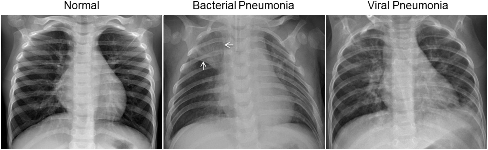

# Google Cloud AutoML Vision for Medical Image Classification

## Pneumonia Detection using Chest X-Ray Images

| | |
|-|-|
|__Title__| Google Cloud AutoML Vision for Medical Image Classification 
|__Author__ | __Ekaba Bisong__  Google Developer Expert in Machine Learning  Google Certified Professional Data Engineer
|__Website__ | <a href="https://ekababisong.org/working-with-keras-gcp/">https://ekababisong.org/working-with-keras-gcp/</a>

Google Cloud AutoML Vision simplifies the creation of custom vision models for image recognition use-cases. The concepts of neural architecture search and transfer learning are used under the hood to find the best network architecture and the optimal hyperparameter configuration that minimizes the loss function of the model. This project uses Google Cloud AutoML Vision to develop an end-to-end medical image classification model for Pneumonia Detection using Chest X-Ray Images.

## About the Dataset
The dataset contains:
- 5,232 chest X-ray images from children.
- 3,883 of those images are samples of bacterial (2,538) and viral (1,345) pneumonia.
- 1,349 samples are healthy lung X-ray images.

The dataset is hosted on Kaggle and can be accessed at <a href="https://www.kaggle.com/paultimothymooney/chest-xray-pneumonia">Chest X-Ray Images (Pneumonia).</a>

## Sample Images

The normal chest X-ray (left panel) shows clear lungs without any areas of abnormal opacification in the image. Bacterial pneumonia (middle) typically exhibits a focal lobar consolidation, in this case in the right upper lobe (white arrows), whereas viral pneumonia (right) manifests with a more diffuse "interstitial" pattern in both lungs. (Source: Kermany, D. S., Goldbaum M., et al. 2018. Identifying Medical Diagnoses and Treatable Diseases by Image-Based Deep Learning. Cell. https://www.cell.com/cell/fulltext/S0092-8674(18)30154-5)